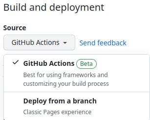
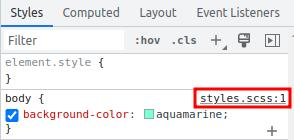

# Test how .scss files work with GitHub Pages

## Table of contents

- [What I learned](#what-i-learned)
  - [Use feature "Deploy from a branch"](#1-use-feature-deploy-from-a-branch)
  - [Configure GitHub Actions workflow](#2-configure-github-actions-workflow)
- [Useful resources](#useful-resources)
- [Author](#author)
- [Acknowledgments](#acknowledgments)

## What I learned

There are 2 ways to compile .scss files to .css when we push code to GitHub.



### 1. Use feature "Deploy from a branch"

In this case we need to create a simple `_config.yml` file.

```yml
sass:
  sass_dir: "css"
  style: compressed
```

This configuration file is for Jekyll, a tool for a simplified build process. It will compile .scss files, and will deploy the site to GitHub Pages with the compiled .css file.

We also need to add two rows of dashes to the beginning of our .scss file, in order for Jekyll to be able to process the file. (Note: if later you switch to another method which is not using Jekyll, these rows will break the first style in the generated .css file.)

```
---
---

```

Unfortunately, looks like Jekyll which is used by GitHub to deploy pages does not work with a plugin that generates a source map, so we will be able to see only references to .css in the browser's DevTools.

### 2. Configure GitHub Actions workflow

For this, we need to create a file with the `.yml` extension, and place it into the `.github/workflows` folder.

In this file, we can customize the workflow to our needs, and use tools of our choice to compile .scss files. I chose to use the npm package `sass` for this purpose, which I also use locally, along with other npm packages which help to watch changes in my site directory, and reload the site in the browser as soon as I save a file.

As I noticed, using npm makes the process of build and deploy twice as fast as when using Jekyll. (It takes too much time to pull the Jekyll image, and build also takes a little bit more time.)

There are also several ways to make it even faster, for example using cache. But in such a small project, when only one npm package needs to be used by GitHub Actions, the fastest way I found is to create two separate `package.json` files, one is for local usage with several npm dependencies, and the other one with only one dependency, which is used by GitHub Actions. Installation of one dependency takes less than 1 second, it is even faster than restoring cache, so there is no need to use cache in this case.

This is the config file for GitHub Actions which I created for usage in my small projects that have .html and .scss files.

```yml
name: GitHub Actions Build and Deploy
on: 
  push:
    branches: [ master ]
    paths: "site/**"
jobs:
  Build-and-Deploy:
    runs-on: ubuntu-latest
    permissions:
      id-token: write
      pages: write
    steps:
      - name: Check out repository code
        uses: actions/checkout@v3
      - run: cd ${{ github.workspace }}
      - name: Change package.json
        run: |
          rm package.json package-lock.json
          mv package-ci.json package.json
          mv package-lock-ci.json package-lock.json
      - name: Install dependencies
        run: npm ci --ignore-scripts
      - run: npm run build
      - name: Upload pages
        uses: actions/upload-pages-artifact@v1
        with:
          path: ./site
      - name: Deploy pages
        uses: actions/deploy-pages@v1
        with:
          token: ${{ secrets.GITHUB_TOKEN }}
```

The parameter `--ignore-scripts` for the `npm ci` command should make the installation process faster in theory, but it can break dependencies which use installation scripts.

And this is my `package-ci.json` file, which will be renamed to `package.json` during the workflow run in order to be used by npm.

```json
{
    "name": "project",
    "version": "0.1.0",
    "description": "Project description",
    "main": "site/index.html",
    "author": "albina0104",
    "scripts": {
        "build": "sass --source-map site/scss:site/css"
    },
    "devDependencies": {
        "sass": "^1.49.8"
    }
}
```

The parameter `--source-map` allows to create a source map, so we are able to see the original .scss file in the browser's DevTools, when we view our deployed site.



## Useful resources

- [Quickstart for GitHub Actions](https://docs.github.com/en/actions/quickstart)
- [Workflow syntax for GitHub Actions](https://docs.github.com/en/actions/using-workflows/workflow-syntax-for-github-actions)
- [Super fast npm install on Github Actions](https://www.voorhoede.nl/en/blog/super-fast-npm-install-on-github-actions/)
    
    Note on this article:
    - When I tried caching `.npm` (the folder with npm cache) it was not really faster: 7s install + 2s saving cache, and the second time 2s restoring cache + 5s install.
    - The alternative, caching `node_modules` (the folder with the installed dependencies) showed itself better: 1 second for restoring cache, and we can skip the installation step!

## Author

- GitHub - [albina0104](https://github.com/albina0104)

## Acknowledgments

- Thanks to Stephanie Eckles for her npm script (article [Minimum Static Site Setup with Sass](https://thinkdobecreate.com/articles/minimum-static-site-sass-setup/))
- and to Kevin Powell for recommending her script in the video [Stop using an extension to compile Sass](https://youtu.be/o4cECvhrBo8)